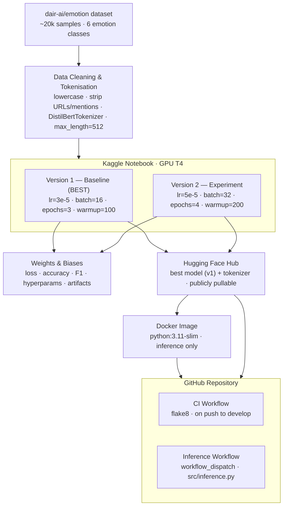

# ml-ops-group-project — Emotion Detection Pipeline

## Overview

End-to-end MLOps pipeline for **6-class emotion detection** using `distilbert-base-uncased` fine-tuned on the [`dair-ai/emotion`](https://huggingface.co/datasets/dair-ai/emotion) dataset. Built as part of the MLOps Group Project coursework.

The pipeline is orchestrated with:
- Dataset loading, cleaning, and preprocessing on Kaggle GPU
- Tokenization using Hugging Face `DistilBertTokenizerFast`
- Fine-tuning with the Hugging Face Trainer API on Kaggle GPU
- Two experiment versions with different hyperparameters
- Experiment tracking with Weights & Biases (W&B)
- Model and tokenizer upload to Hugging Face Hub
- Dockerised inference container
- CI and inference automation via GitHub Actions

---

## Pipeline Architecture



---

## Project Resources

| Resource | Link |
|---|---|
| GitHub Repository | https://github.com/aniliter-cloud/ml-ops-group-project |
| Kaggle Notebook | https://www.kaggle.com/code/anilg25ait2009/mlops-group-projects/ |
| Hugging Face Model | https://huggingface.co/Maxii2tj/emotion-distilbert |
| W&B Project Dashboard | https://wandb.ai/maxi-i2tj-na/mlops-group-project |
| Docker Image | https://hub.docker.com/r/maxii2tj/mlops-a3-inference |

---

## Project Structure

```
.
├── .github/
│   └── workflows/
│       ├── ci.yml                  # Linting on push to develop
│       └── inference.yml           # Manual inference trigger
├── src/
│   ├── inference.py                # Inference script
│   └── processing.py
├── Dockerfile                      # Inference container
├── docker-compose.yml
├── requirements.txt
├── requirements-inference.txt
├── id2label.json                   Label mapping (6 emotion classes)
└── README.md
```

---

## Dataset

**Dataset:** [`dair-ai/emotion`](https://huggingface.co/datasets/dair-ai/emotion)
**Task:** 6-class text classification
**Classes:** `sadness`, `joy`, `love`, `anger`, `fear`, `surprise`
**Size:** ~20,000 samples (train 16k / validation 2k / test 2k)

### Class Distribution (Train Split)

| Class | Count | % |
|---|---|---|
| joy | 5,362 | 33.5% |
| sadness | 4,666 | 29.2% |
| anger | 2,159 | 13.5% |
| fear | 1,937 | 12.1% |
| love | 1,304 | 8.2% |
| surprise | 572 | 3.6% |

> The dataset is imbalanced — `surprise` and `love` are under-represented. This is why **weighted F1** (not plain accuracy) is used as the primary comparison metric between versions.

### Cleaning Steps Applied

| Step | Reason |
|---|---|
| Lowercase all text | DistilBERT-uncased expects lowercase input |
| Strip URLs | Carry no emotional signal |
| Remove `@mentions` and `#hashtags` | Platform artefacts, not emotion indicators |
| Collapse whitespace | Normalises newlines and multi-space artefacts |
| Filter empty texts | Removes rows that became empty after cleaning |

---

## Model

**Model:** `distilbert-base-uncased`
**Parameters:** ~66M
**HF Model Card:** https://huggingface.co/distilbert-base-uncased

DistilBERT is a knowledge-distilled, lighter version of BERT — approximately 40% smaller and 60% faster — making it well-suited to Kaggle's free GPU tier. The uncased variant was chosen because emotion classification depends on semantic meaning rather than capitalisation patterns, reducing vocabulary size and improving token consistency. With 6 output labels loaded from `id2label.json`, and a max token length of **512** (sufficient for short tweets — typically under 30 tokens), the model fits comfortably within Kaggle's free GPU hours, with each version training in under 6 minutes on a T4 GPU.

---

## Training Configuration — Two Experiment Versions

| Parameter | Version 1 (v1) | Version 2 (v2) |
|---|---|---|
| Model | distilbert-base-uncased | distilbert-base-uncased |
| Learning Rate | 3e-5 | 5e-5 |
| Batch Size | 16 | 32 |
| Epochs | 3 | **4** |
| Max Token Length | **512** | **512** |
| Weight Decay | 0.01 | 0.01 |
| Warmup Steps | 100 | **200** |
| Eval Strategy | epoch | epoch |
| Platform | Kaggle T4 GPU | Kaggle T4 GPU |
| Experiment Tracking | W&B | W&B |

---

## Results — Version 1 vs Version 2

| Metric | Version 1 | Version 2 | Winner |
|---|---|---|---|
| Test Accuracy | **0.9290** | 0.9285 | V1 |
| Test Weighted F1 | **0.9292** | 0.9285 | V1 |
| Test Loss | 0.3157 | **0.2920** | V2 |
| Training Time (T4 GPU) | ~4m 46s | ~5m 24s | V1 (faster) |

### Per-Class Weighted F1

| Class | V1 | V2 | Support |
|---|---|---|---|
| sadness | 0.97 | 0.97 | 581 |
| joy | 0.95 | 0.95 | 695 |
| love | 0.83 | 0.83 | 159 |
| anger | 0.92 | 0.93 | 275 |
| fear | 0.89 | 0.90 | 224 |
| surprise | 0.78 | 0.74 | 66 |

### Why Version 1 Won — Intuition

V1's conservative learning rate (`3e-5`) and smaller batch size (`16`) led to more stable, careful weight updates that generalised better to the unseen test set — achieving F1=0.9292 and accuracy=0.9290.

V2's higher learning rate (`5e-5`) and larger batch size (`32`) produced a lower test loss (0.2920 vs 0.3157), but the more aggressive training caused a slight drop in test F1 (0.9285) and accuracy (0.9285), suggesting marginal overfitting despite the extra warmup steps.

`load_best_model_at_end=True` + `metric_for_best_model="f1"` ensured each version's **best checkpoint** was restored before final test evaluation, so the reported metrics reflect each model's peak performance rather than its final epoch.

> **Net result:** V1's conservative baseline outperformed V2 on accuracy and F1. **Version 1 was selected as the best model** and pushed to Hugging Face Hub.

---

## Setup Instructions

### Prerequisites

- Python 3.11+
- Docker (for inference container)
- Accounts: Kaggle, Hugging Face, Weights & Biases

### 1. Clone the Repository

```bash
git clone https://github.com/aniliter-cloud/ml-ops-group-project.git
cd ml-ops-group-project
```

### 2. Install Dependencies

```bash
pip install -r requirements.txt
```

### 3. Set Environment Variables

```bash
export HF_TOKEN=<hf_token>
export WANDB_API_KEY=<wandb_key>
```

---

## Running on Kaggle (Recommended for Training)

1. Open the Kaggle notebook link above
2. Enable GPU: **Settings → Accelerator → GPU T4 x2**
3. Add the following Kaggle Secrets (**Add-ons → Secrets**):
   - `WANDB_API_KEY`
   - `HF_TOKEN`
4. **Run all cells top to bottom** — both versions train sequentially in the same session, no kernel restart needed:
   - Cells 1–10: shared setup (install, auth, data, clean, tokenise @ `max_length=512`, datasets, metrics, `build_trainer`)
   - Cell 11: **Version 1** trains (3 epochs) → logged to W&B as `distilbert-run-v1`
   - Cell 12: **Version 2** trains (4 epochs) → logged to W&B as `distilbert-run-v2`
   - Cell 13: side-by-side comparison, best version (v1) selected by F1
   - Cell 14: best model pushed to Hugging Face Hub + final W&B summary

The notebook will:
- Load and clean the `dair-ai/emotion` dataset
- Tokenize using `DistilBertTokenizerFast` with `max_length=512`
- Train both versions with their respective hyperparameters
- Log all metrics to W&B (loss, accuracy, F1, hyperparams per run)
- Save `eval_report_v1.json` and `eval_report_v2.json` as W&B artifacts
- Push the **best model (v1)** and tokenizer to Hugging Face Hub

---

## Running Inference

The trained emotion classification model can be executed using Docker Compose, Docker, or directly through the Python inference script.

### Option 1: Run with Docker Compose (Recommended)

Start the inference container using Docker Compose:

```bash
docker compose up
```

> **Note:** The model is publicly available on Hugging Face, so no authentication is required. If the `HF_TOKEN` environment variable is set, Docker Compose will automatically use it for authenticated access.

---

### Option 2: Run with Docker

Pull the latest Docker image from Docker Hub:

```bash
docker pull maxii2tj/mlops-a3-inference:latest
```

Run inference:

```bash
docker run --rm \
  -e INPUT_TEXT="I feel so happy today" \
  maxii2tj/mlops-a3-inference:latest
```

If you have a Hugging Face access token, you can optionally pass it:

```bash
docker run --rm \
  -e HF_TOKEN=$HF_TOKEN \
  -e INPUT_TEXT="I feel so happy today" \
  maxii2tj/mlops-a3-inference:latest
```

> **Note:** Since the Hugging Face model is public, `HF_TOKEN` is optional. Providing it helps avoid Hugging Face rate limits and may speed up model downloads.

---

### Option 3: Run the Python Script Directly

Install the inference dependencies:

```bash
pip install -r requirements-inference.txt
```

Run the inference script:

```bash
INPUT_TEXT="I feel so happy today" python3 src/inference.py
```

To use a different Hugging Face model or authenticate with Hugging Face (optional):

```bash
export HF_MODEL_NAME=Maxii2tj/emotion-distilbert
export HF_TOKEN=<hugging_face_token>

INPUT_TEXT="I feel so happy today" python3 src/inference.py
```

---

## GitHub Actions Workflows

### CI Workflow (`ci.yml`)
- **Triggers:** push to `develop`, pull request to `main`
- **Steps:** checkout → setup Python 3.11 → install deps → run `flake8` on `src/`

### Inference Workflow (`inference.yml`)
- **Triggers:** manual (`workflow_dispatch`) with `input_text` parameter
- **Steps:** checkout → setup Python 3.11 → install deps → run `src/inference.py`
- **Secrets required:** `HF_TOKEN` (set in GitHub → Settings → Secrets and Variables → Actions)

> GitHub Actions is used **only for CI and inference, never for training** — all training runs on Kaggle Notebooks with GPU T4.

---

## W&B Experiment Tracking

Both runs are logged to [`mlops-group-project`](https://wandb.ai/maxi-i2tj-na/mlops-group-project) on W&B.

Metrics tracked per run:
- Training loss (per step, every 50 steps)
- Validation loss, accuracy, weighted F1 (per epoch)
- All hyperparameters (lr, batch, epochs, warmup, weight decay, max_length, model, platform, version)
- Final test-set metrics under `final/` prefix
- `eval_report_v1.json` and `eval_report_v2.json` as versioned W&B artifacts
- A final `final-summary` run records the winning version, HF model URL, and both versions' accuracy/F1

---

## Technologies Used

- Python 3.11
- PyTorch
- Hugging Face Transformers & Datasets
- Scikit-learn
- Weights & Biases
- Kaggle Notebooks (GPU T4)
- Docker
- GitHub Actions


---

## Authors

| Name | Role |
|---|---|
| Anil Kumar Das | G25AIT2009 |
| Ravi Kant Pandey | G25AIT2085 |
